# CoinFrog

[Link to Live Site Here](https://coin-frog.herokuapp.com/)

The purpose of CoinFrog is to allow users to gain an insight into all cryptocurrencies available on CoinMarketCap. They will be able to enter a coin they want to know more about and the programme will output the relevant information. CoinFrog also has a price converter function.

CoinFrog is a Python only programme which is run on a mock terminal. Once Run users will be navigated to the Main Menu where they can chose what they would like to do. The first option will allow them to vunderstand how the program works, providing a description of what the program is and the features it has. The second option will allow them to 'Get Coin Info' where users enter a ticker and will be able to view the coins data e.g name, price, market cap, TVL etc.  

The final option will navigate them to the 'Crypto Converter' where users will have three options. The first will ask the user to enter the USD amount they would like to spend and then the coin they would like to buy. The program will then calculate the amount of that coin they can buy with the USD available. The second option will allow the user to enter a coin and the amount they wish to buy and the program will calculate the USD needed to purchase it. The third option will allow user to convert from one cryptocurrency to another (e.g. 2 $ETH = 425 $LINK) this way they can easily calculate how much of one coin is worth in another.     

---
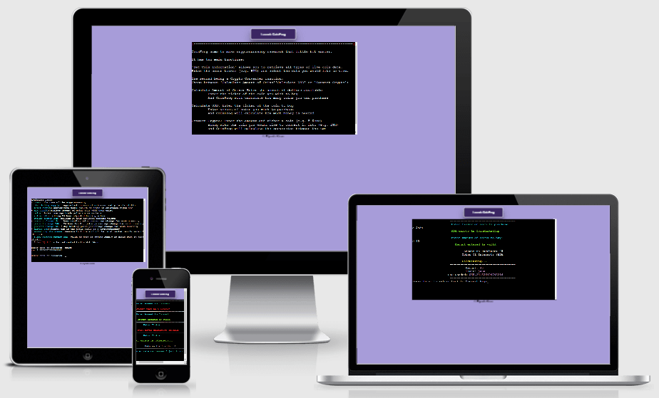
---

# User Experience (UX) 

* ## Vision
    My vision for CoinFrog is to be an application people go to if they want to quickly find out information about a certain cryptocurrency. The program is meant to be simple yet effective and provide a real use case to people intrested in crypto. Not only is the program useful if you want to find information about a coin or token but it also lets users to quickly see how much USD is needed to buy the coin of their choice. As the program also allows users to see how much of a certain coin or token they can buy with x amount of USD the program should cater for all user needs.        

* ## Aims
    To provide users an application they can go to when they want to find out more about a coin and also allow them to quickly calculate the coin or USD amount needed in order to successfully purchase the coin of their choice.

* ## Target Audience
    Crypto is for everyone so there is no specific target audience. However, the program does require you to have a basic understanding about crypto as it does ask users to enter a coin of their choice and provides data which is cryptocurrency specific, so the application is not targetted at people who have limited understanding about cryptocurrencies as they won't be able to get the most out of it. 

* ## User Stories

1. I want to easily understand the purpose of the site and learn how to use the program.

2. I want to be able to find out live cryptocurrency information

3. I want to be able to calculate the USD needed in order to purchase x amount of coins

4. I want to be able to calculate how many coins I can purchase with x amount of USD

5. I want to be able to convert x amount of one coin into another coin

6. I want to see if there are new features added to the site 

* ## Development Method 

When creating CoinFrog I will take a waterfall approach when developing. That is, creating sections of the program at a time and ensuring they work as intended before going onto the next section. I will be able to break up development by choosing small elements to work on daily, ensuring the program can be built and published in a timely fashion. As this project is Python only, all my time will be spent on developing and testing the logic behind the program. I will work on developing each class and function and getting them working before I move onto the next section of development. 

* ## Scope

Features to be included:

* The main title screen which will display when the user runs the program. The title screen displays the options available to the user allowing them to navigate through the program and use the different functionalities.

* The first option they can select will be the 'What is CoinFrog' section where they can learn what the program is about and the different functions of it thus allowing them to understand how the program works and what you can do with it. This is mainly for people who are not familiar with crypto as at first the program may be confusing however if you are familiar with cryptocurrencies then the program should be very simple to understand.  

* The next option they can select will be the 'Get Coin Information' section where users are able to enter a ticker of the coin they wish to know more about and will be able to see the coins live data by selecting from the options available.

* The final option the user can select will be the 'Crypto Converter' section where users can enter the USD amount of a coin they are looking to buy and the program will calculate how much of that coin they are able to purchase with the USD available. Additionally, users can enter the amount of a certain coin they wish to purchase and the program will calculate the USD amout needed in order to purchase it. Finally, users will be able to chose a coin they would like to compare to another coin (e.g. 1 $ETH = 905 $THETA).

* ## Structure 
    
    * The mock terminal has been created for me by using the Code Institute template so all the file apart from any python files created were not made by me

    * run.py is what Heroku will run when the site is published so this is will act as my 'main' file and is responsible for running the game. Any other python files created will contain the relevant functions needed to run the game which will be imported and called in run.py 

    * As a result of the terminal I am using to run the program on, which is supplied by Code Institute. The application does not run when the device you are viewing it on has a screen width of less than 750px x 750px. So if a user does try open the program on such device then a message will appear letting them know that it cannot be run on a device that small. Additionally, if JavaScipt is not enabled then the program is not able to run so I have a message that appears if this is the case. 

* ## Flowcharts

* I used [LucidChart](lucidchart.com) to help design the project and create the following flowcharts.

### Program Flow Charts:

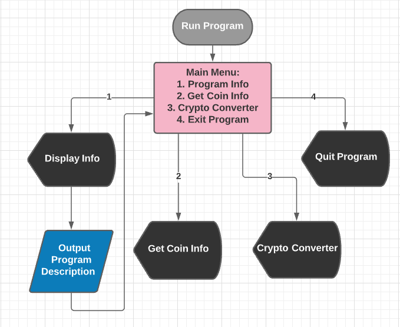

Crypto Converter:

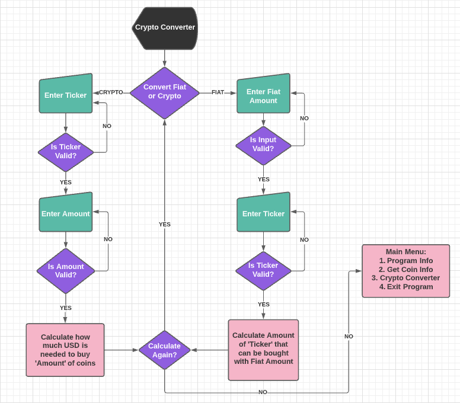

Get Coin Information:

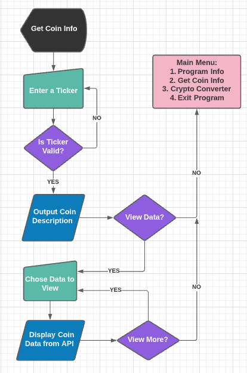

## Design 

Landing Page:
- The page the user sees when the CoinFrog is launched
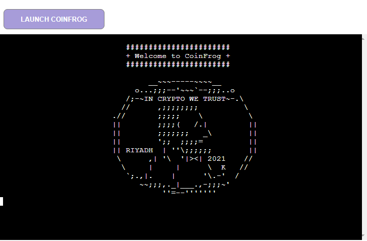

Main Menu:
- The menu the user uses to navigate through the program
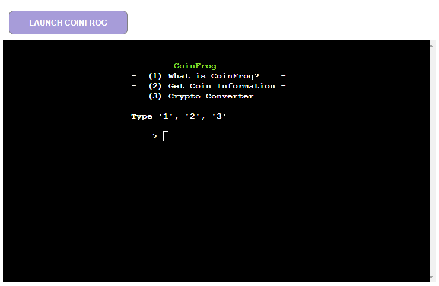

What is CoinFrog:
- The page the user is navigated to if they want to learn about the program
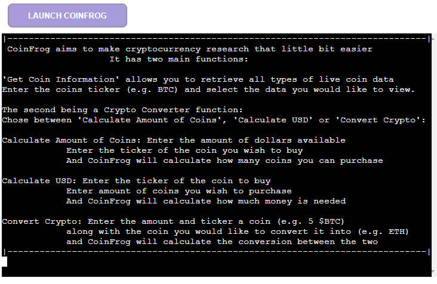

Get Coin Information:
- This is page the user is navigated to if the want to retrieve live coin data
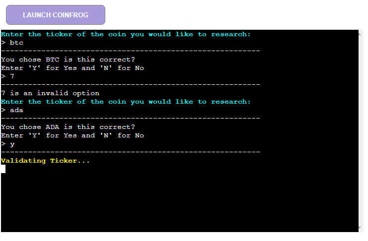


    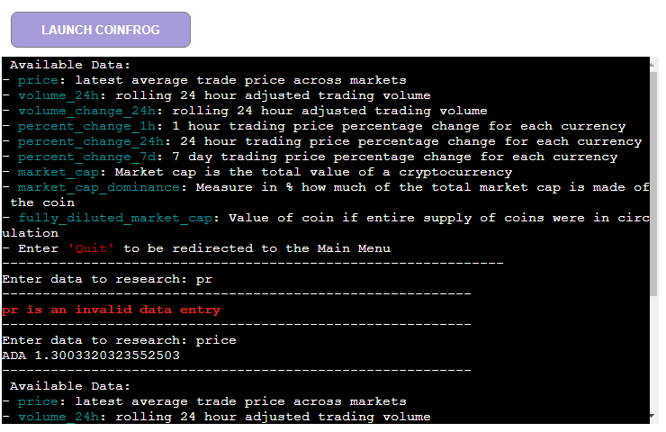


    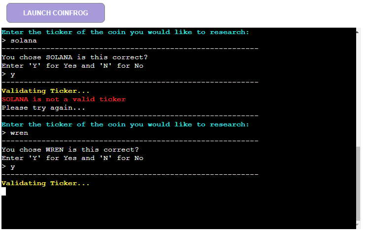


Conversion Menu ~
- The menu the user is taken to if they would like to complete a crypto conversion

    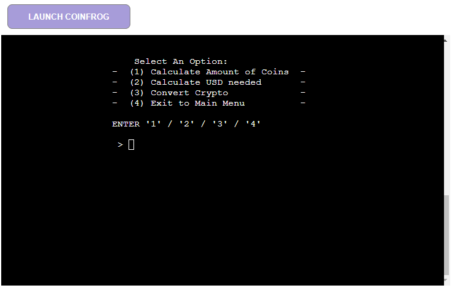

Calculate Amount of Coins:

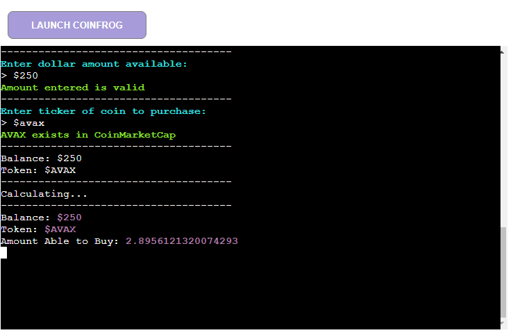

Calculate USD Needed:

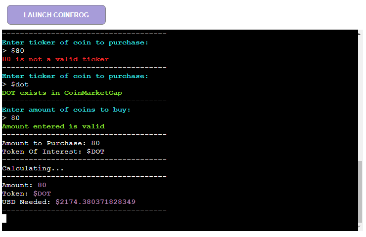

Calculate Crypto:

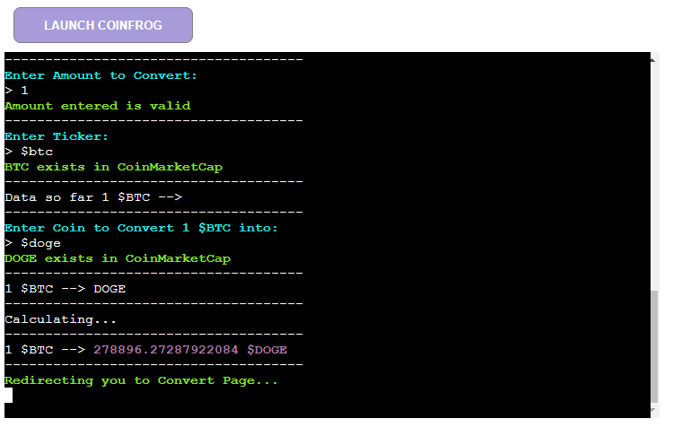

Exit CoinFrog:

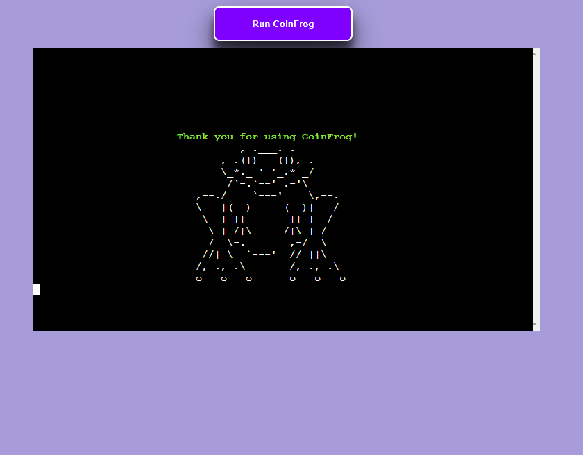

If the user is viewing the program on a device with a screen size of less than 750px x 750px:

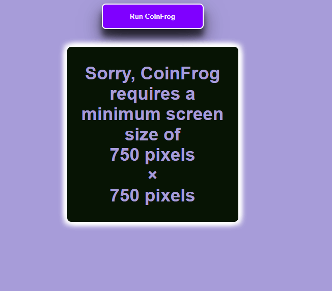

I wanted to include a favicon because I felt that it would help make the program feel more polished. As a result of Heroku not being able to host static files like images I had to use a web-hosted favicon from [favicon.cc](https://www.favicon.cc/). The actual icon I decided to use is linked [HERE](https://www.favicon.cc/?action=icon&file_id=686886). The limitation of using this is that the favicon will not display in Internet Explorer.

# Features 

Here describes the main features of the website and what the user can expect when viewing ~

## Existing Features:

CoinFrog has several features:

The 'Get Coin Information' feature allows the user to enter any ticker of their choice (as long as it is in the top 2000 coins on CoinMarketCap), the program will then display a list of data points the user can chose from. Depending on what the user choses e.g. name, total supply etc. the live data will be displayed to the user.

The 'Crypto Converter' has three functions available to the user:
The first is 'Calculate Amount of Coins' this asks the user to enter their dollar amount available and the coin they wish to buy. CoinFrog will then work out the amount of that coin they can purchase with the amount of dollars available

The second is 'Calculate USD Needed' this asks the user to enter the coin of interest and the amount the wish to buy. CoinFrog will calculate how much USD is needed in order to purchase said amount of coins.

The third is 'Crypto Converter', the program asks the user the amount and coin they wish to convert along with the coin they wish to convert it into (e.g. 5 $BTC into $ADA). CoinFrog will work out how much of x coin they can purchase with the amount they currently have. 

## Future Features:

A feature that I didn't have enough time to implement was for the program to generate a description of the coin when in the 'Get Coin Information' section. I wanted the program to display the description before they chose the data they would like to view. However I found difficulty accessing this data from the API as the JSON route was different. 

# Technologies 
## Languages Used

- [Python](https://www.python.org/) - Python is an interpreted high-level general-purpose programming language

- I used GitHub [Project Board](https://github.com/RiyadhKh4n/CoinFrog/projects/1) to keep track of all the tasks necessary in order to build this application

## Frameworks, Libraries & Programs Used:

1. [GitPod](https://www.gitpod.io/):
    * GitPod was the IDE used to create the site

2. [Git](https://git-scm.com/):
    * Git was used for version control by utilizing the Gitpod terminal to commit to Git and Push to GitHub.

3. [GitHub](https://github.com/):
    * GitHub is used to store the projects code after being pushed from Git.

4. [Google Developer Tools](https://developer.chrome.com/docs/devtools/):
    * Used to test the program throughout development

5. [Os Library](https://docs.python.org/3/library/os.html)
    * Used to clear the console.

6. [Heroku](https://dashboard.heroku.com/login)
    * Used to Deploy the Project

7. [LucidChart](https://www.lucidchart.com/pages/)
    * Used to design my flowcharts.

8. [AMiResponsive](http://ami.responsivedesign.is/)
    * To generate the image at the beginning of the README

9. [CoinMarketCap](https://coinmarketcap.com/api/)
    * Used the CoinMarketCap API to retrieve live coin data

10. [TinyPNG](https://tinypng.com/)
    * This was used to compress all images used in the README.md

11. [PEP8](http://pep8online.com/)
    * Used to validate my Python code

12. [favicon.cc](https://www.favicon.cc/)
    * Used to generate the favicon address from the hosted site

13. [Colorama](https://pypi.org/project/colorama/)
    * Used to colour the text that is outputted to the terminal 

14. [PromptToolkit](https://github.com/prompt-toolkit/python-prompt-toolkit)
    * Is a libary for building powerful interactive command line applications in Python

15. [Requests](https://pypi.org/project/requests/)
    * Allowed me to sent HTTP requests without having to manually add query to strings to the URLs

# Testing 

Due to the size of the testing section for CoinFrog I have created [TESTING.md](TESTING.md). It also shows all tested screenshots, any errors/bugs I encountered, and how I fixed them when creating this project. This is also where you can find any responsiveness screenshots, and browser compatibility tests.

[Link To Testing.md](TESTING.md)
   
# Deployment 

Deploying the project using Heroku:
* Visit the [Heroku](https://dashboard.heroku.com/login) site and create an account
* Click the "New" Button
* Click the "Create new app" button
* Provide a name for the app in the App name input field
* Select your region from the choose region dropdown menu 
* Click the "Create App" button
* Once redirected, proceed to the settings tab
* Click on the "config vars" button
* Supply a KEY of `PORT` and it's value of `8000`. The click the "add" button
* Next step is to add Buildpacks, click the "Add Buildpack" button
* The `python` buildpack needs to be added first then the `nodejs` buildpack
* Once the buildpacks have completed, go to the deploy screen, once in the deploy screen, select GitHub as the deployment method and connect your GitHub profile
* Search for the repository that you wish to deploy to Heroku and click "connect"
* Once your repository is connected to Heroku you can choose to either manually or automatically deploy your app.
* By selecting automatic deploys, Heroku will build a new version of the app each time a change has been pushed to the repository
* Manual deploys allow you to build a new version of your app whenever you click manual deploy
* If your build is successful you will then be able to visit the live site by clicking the link that is provided to you by Heroku

Command to add packages to requirements.txt, `pip3 freeze --local > requirements.txt` 

## Making a Local Clone

1. Log in to GitHub and locate the [GitHub Repository](https://github.com/RiyadhKh4n/CoinFrog)
2. Under the repository name, click "Clone or download".
3. To clone the repository using HTTPS, under "Clone with HTTPS", copy the link.
4. Open Git Bash
5. Change the current working directory to the location where you want the cloned directory to be made.
6. Type `git clone`, and then paste the URL you copied in Step 3.

    $ `git clone https://github.com/RiyadhKh4n/CoinFrog.git` 

7. Press Enter. Your local clone will be created. 

```shell
$ git clone https://github.com/RiyadhKh4n/CoinFrog.git
> Cloning into `CI-Clone`...
> remote: Counting objects: 10, done.
> remote: Compressing objects: 100% (8/8), done.
> remove: Total 10 (delta 1), reused 10 (delta 1)
> Unpacking objects: 100% (10/10), done.
```

Alternatively, if using Gitpod, you can click below to create your own workspace using this repository.

[](https://gitpod.io/#https://github.com/RiyadhKh4n/CoinFrog)

You will need to also install all required packages in order to run this application on Heroku, refer to [requirements.txt](requirements.txt)
* Command to install this apps requirements is `pip3 install -r requirements.txt`

# Credits 
All coin data is taken from [CoinMarketCap](https://coinmarketcap.com/)

## Code
When developing CoinFrog I had to implement a third-party API which was something I had never done before as a result I used [this](https://www.youtube.com/watch?v=ECJjjZ_iijc&t=1s) YouTube video which explained how to retrieve data from the API and print it to the console.

The code which displays when the users screen size is less than 750px x 750px was inspired by a fellow pupil from Slack. The HTML code is the same however the styling is different as I wanted it to match the rest of my site.

All other code is original

### Acknowledgements
* Tim - My Mentor
* Tutor Support
* Fellow students from Slack


