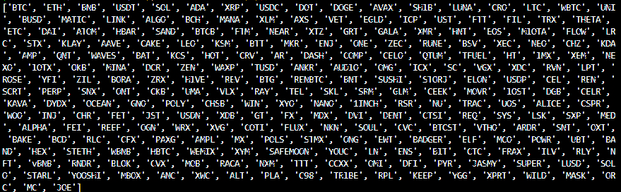

# Initial Testing
 
Python Validator:
ADD SS HERE

# Website Testing (Solving Issues):

The first issue I encountered is that I have validate the ticker the user enters before they can move on with the porgram. This is because if an invalid ticker is entered there will be no output as the API cannot be called. In order to do this, I have to check that the ticker they entered matches with a ticker present on CoinMarketCap, however this is where the issue lies. I was unable to simply pass in the variable which holds the users input into the API call as it would return an error. 

Therefore, I decided that I would need to collect all the available tickers taken from my params (coinmarketcap.py line 9) and push them to a list. This list can then be iterated through against the users input where I can then validate whether their input is valid or not. As a result, I created a new function called get_ticker_list() that would do just this.   

```
tickerList = []

def get_ticker_list():
    for d in data['data']:
        ticker = d['symbol']
        tickerList.append(ticker)

```

tickerList[] is the list which will hold all the ticker in my params range. The function is simple, it iterates through data which holds the json file of all the latest listings. A variable 'ticker' is then created which stores each symbol within the API. Finally, tickerList is then appended to creating the list of tickers I can validate from. By printing out tickerList you can see the first 250 coins from CoinMarketCap.



The next step was to create the validate_ticker(ticker) function which would iterate through tickerList and check to see if the users input exists within the list.

```
def validate_ticker(ticker):
    """
    Will validate if the users ticker exits in tickerList
    """
    for x in tickerList:
        if ticker in tickerList:
            print(f"{ticker} exists in CoinMarketCap")
            return True
            break
        else:
            print(f"{ticker} does not exist in CoinMarketCap")
            return False
            break

```

get_ticker_list() takes in ticker (which is the user input) as a parameter. It iterates through tickerList and checks to see if ticker is an element within the list. If it is, it returns True and a print statement saying that it valid, else it returns False. This was I can use the returned value as a flag to ask the user to either enter a new ticker or allow them to move on with the program. 