# Testing
 
[PEP8](http://pep8online.com/) Python Validator:

Results for [run.py](run.py) ~
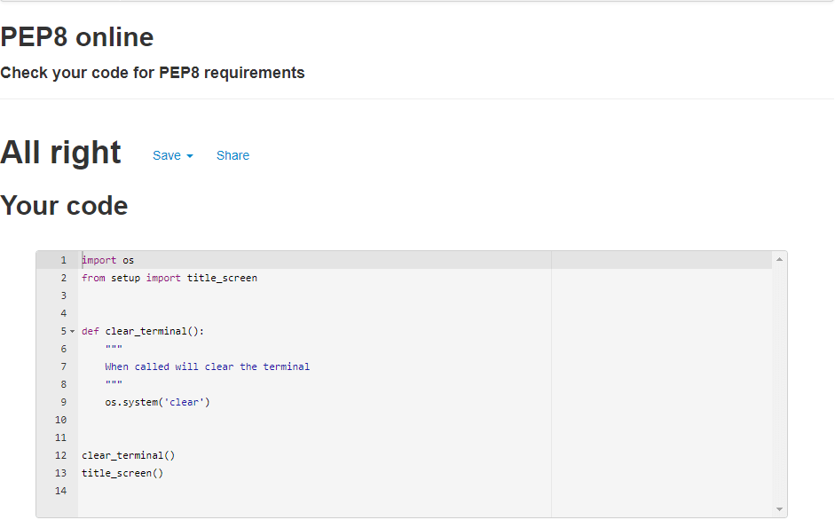

Results for [setup.py](setup.py) ~
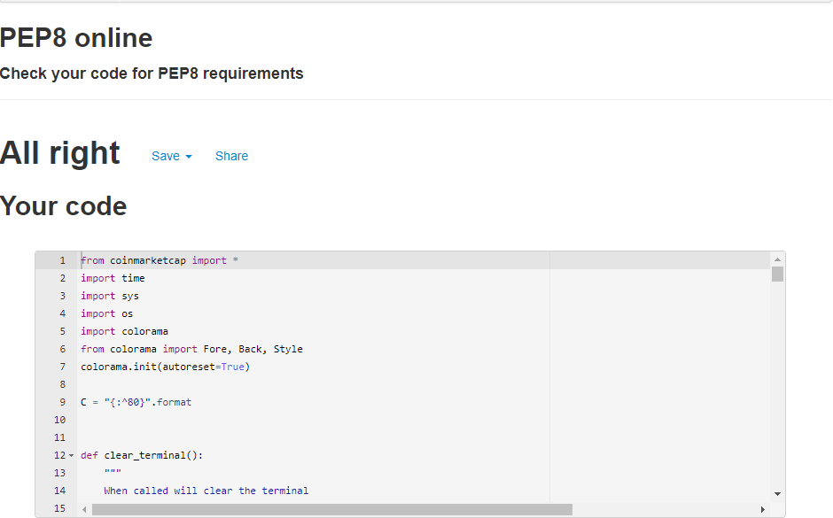

Results for [coinmarketcap.py](coinmarketcap.py) ~
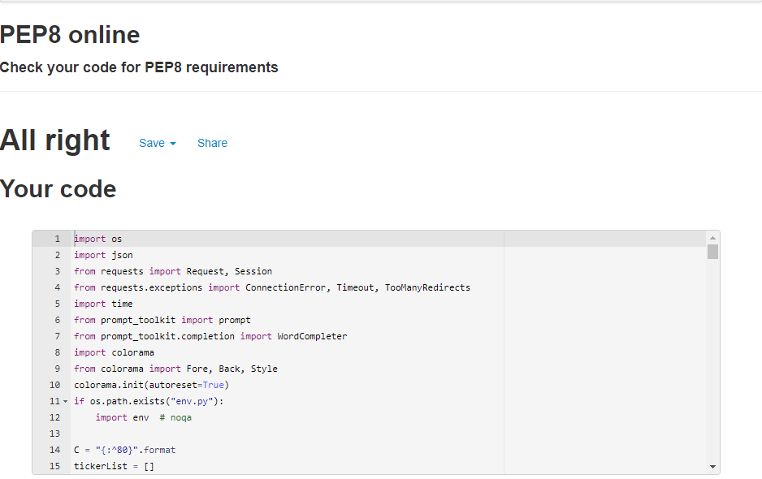

# Website Testing (Solving Issues):

The first issue I encountered is that I have validate the ticker the user enters before they can move on with the porgram. This is because if an invalid ticker is entered there will be no output as the API cannot be called. In order to do this, I have to check that the ticker they entered matches with a ticker present on CoinMarketCap, however this is where the issue lies. I was unable to simply pass in the variable which holds the users input into the API call as it would return an error. 

Therefore, I decided that I would need to collect all the available tickers taken from my params (coinmarketcap.py line 9) and push them to a list. This list can then be iterated through against the users input where I can then validate whether their input is valid or not. As a result, I created a new function called `get_ticker_list()` that would do just this.   

```
tickerList = []

def get_ticker_list():
    for d in data['data']:
        ticker = d['symbol']
        tickerList.append(ticker)

```

tickerList[] is the list which will hold all the ticker in my params range. The function is simple, it iterates through data which holds the json file of all the latest listings. A variable `ticker` is then created which stores each symbol within the API. Finally, tickerList is then appended to creating the list of tickers I can validate from. By printing out tickerList you can see the first 250 coins from CoinMarketCap.

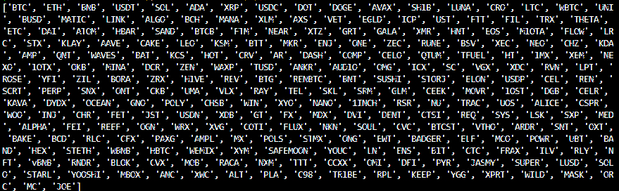

The next step was to create the validate_ticker(ticker) function which would iterate through tickerList and check to see if the users input exists within the list.

```
def validate_ticker(ticker):
    """
    Will validate if the users ticker exits in tickerList
    """
    for x in tickerList:
        if ticker in tickerList:
            print(f"{ticker} exists in CoinMarketCap")
            return True
            break
        else:
            print(f"{ticker} does not exist in CoinMarketCap")
            return False
            break

```

`get_ticker_list()` takes in `ticker` (which is the user input) as a parameter. It iterates through `tickerList` and checks to see if `ticker` is an element within the list. If it is, it returns `True` and a print statement saying that it is valid, else it returns `False`. This was I can use the returned value as a flag to ask the user to either enter a new ticker or allow them to move on with the program. 

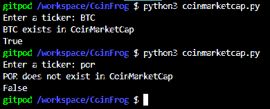

```
def get_coin_data():
    """
    Function which allows users to enter coin they wish to know more about
    and enables them to go through list of options
    """

    ticker = ''
    option = ''
    while option not in ['y', 'n']:
        true_or_false = None
        print("Enter the ticker of the coin you would like to research:")
        ticker = input('> ').upper()
        print("----------------------------------------------------------")

        tickerLength = 0
        for x in ticker:
            tickerLength = tickerLength + 1

        if tickerLength == 0:
            time.sleep(0.5)
            print("Ticker cannot be blank!")
            print("----------------------------------------------------------")

        elif tickerLength < 3:
            time.sleep(0.5)
            print("Ticker must have 3 characters minimum")
            print("----------------------------------------------------------")

        else:
            print(f"You chose {ticker} is this correct?")
            print("Enter 'Y' for Yes and 'N' for No")
            choice = input('> ').lower().strip()
            time.sleep(1)
            print("----------------------------------------------------------")
        
            if choice == ("y"):
                print("Validating Ticker...")
                time.sleep(1)
                true_or_false = validate_ticker(ticker)

                if true_or_false == True: 
                    break

                else:           
                    time.sleep(0.5)
                    print("Please try again...")
                    print("----------------------------------------------------------")

            elif choice == ("n"):
                print("Nevermind, try again...")
                time.sleep(0.5)

            else:
                time.sleep(0.5)
                print(f"{choice} is an invalid option")
```

This function is responsible for handling the user input and is where the `validate_ticker(ticker)` is called. It handles the input by asking for the ticker the user would like to know about. If `ticker` is empty then the appropriate output is displayed. Additionally, if the input is less than 3 characters a message will output as all tickers have 3 character minimum and would therefore be a void input. If it does meet these conditions then it asks the user to confirm their input and will ouput the neccessary response. If the response is 'y' then `ticker` will then be passed to `validate_ticker(ticker)` to see if their input exists within the list.

Below is an example of a valid input:

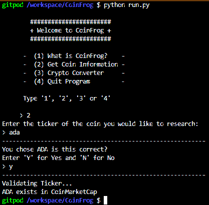

Below is an example of another valid input but where the user decided to change the ticker they would like research:

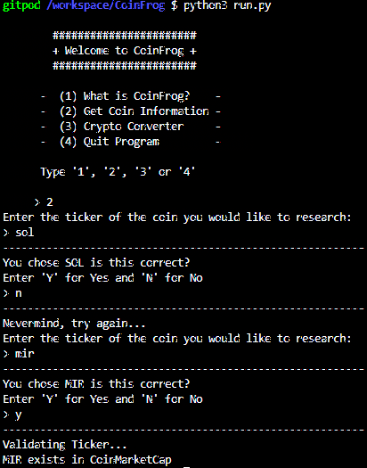

Here is shows what outputs when the users inputs are invalid:

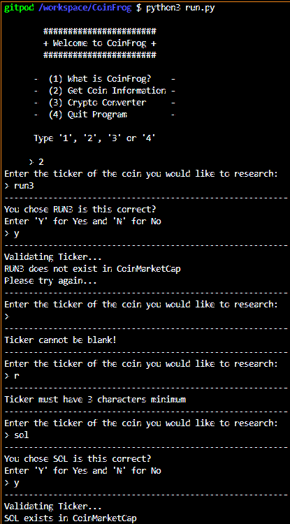

--- 

The next issue I had to solve was I needed to be able pass the user input (ticker) to the API in order be able to retrieve the appropriate data that the user wanted to view. I first began with the demo function that I used in order to call the api with the ticker hard coded.

```
def getSHIBprice():
    for d in data['data']:
        if d['symbol'] == 'SHIB':
            price = float((d['quote']['USD']['price']))
            print(format(price, '.20f'))

```

I knew I had to modify this function by passing in a parameter and changing the route the function takes when going through the JSON file. I began by changing the 'if' statement so instead of checking against a hard coded ticker like SHIB I would check it against the parameter which would be the ticker the user wanted to know about. The function now looks like this:

```
def display_coin_data(ticker):
 for d in data['data']:
        if d['symbol'] == ticker:
            price = float((d['quote']['USD']['price']))
            print(x['symbol'],  price)
```

Now the function takes in the ticker and assigns it to the 'symbol' which is needed in order get the correct data in the API. The variable price will now store the price of the ticker that the user entered which will then be printed to the console. The working function output can be seen below:

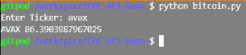
 
However as a extra validation step I want the function to ensure that the ticker the user entered also exists within `tickerList` in order to minimise the posibility of an invalid ticker being passed to the API which would result in an error. Therefore before the function iterates through data in order to retrieve the price, I have implemented an if statement which would check if the ticker exists in `tickerList`. The function now looks like this:

```
def display_coin_data(ticker):
    if ticker in tickerList:
        for x in coins:
            if x['symbol'] == ticker:
                print(x['symbol'],  x['quote']['USD']['price'])
    else:
        print("Ticker not in List") 
```

The function will now output "Ticker not in List" if the user manages to break the previous validation and tries to pass in an invalid ticker to the API, helping to minimise an error. I have also removed the price variable as eventually I want this function to be able to output all the available data in the API. 

The next step was to create the `prompt_toolkit_function()` which makes use of prompt_toolkit and WordCompleter. This is because when asking the user the data they would like to view, I have to ensure the input matches the API JSON file exactly. Which can be seen below:
 
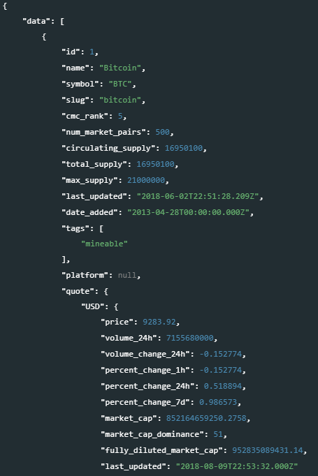

The input must match exactly otherwise I wont be able to call the appropriate data. Thus by using WordCompleter I can ensure the correct input is passed to `display_coin_data(ticker)`. I begin by creating a variable called `answers` which holds a list of all the data the user is able to view. Then this same list is passed to WordCompleter which is stored in a variable called `api_data`. A while loop is created in order to validate that the users input conforms with the list in `answers`. If not a message will appear telling them that their entry is invalid and will then ask the user the question again. The variable `text` uses prompt_toolkit which asks the user a question and provides a list of potential data values they can chose from. If `text in answers` then their input will be shown to them and `text` is returned. The function is provided below:

```
def prompt_toolkit_function():
    text = ''
    answers = ['price', 'volume_24h', 'volume_change_24h', 'percent_change_1h','percent_change_24h', 'percent_change_7d', 'market_cap', 'market_cap_dominance', 'fully_diluted_market_cap']
    api_data = WordCompleter(['price', 'volume_24h', 'volume_change_24h', 'percent_change_1h', 'percent_change_24h', 'percent_change_7d', 'market_cap', 'market_cap_dominance', 'fully_diluted_market_cap'])
    while text not in answers:
        text = prompt('Enter data to research: ', completer=api_data)

        if text in answers:
            print(f'Data: {text}')
            return text

        else:
            time.sleep(0.5)
            print("----------------------------------------------------------")
            print(f"{text} is an invalid data entry")
            print("----------------------------------------------------------")
```

By returning `text` this can then be stored in a variable in setup.py which can then be passed to `display_coin_data(ticker)` which will now have ticker and data as parameters. As I am able to ensure the data the user wants to view matches the JSON format, this can be passed to the function instead of 'price' which was hard coded to only get the price of the coin. This way the user is now able to view all data in `answers` where the one function `display_coin_data(ticker, data)` will print whatever the user wants to see. The updated function is below:

```

def display_coin_data(ticker, data):
    """
    Will display relevant data that user asks for
    """

    if ticker in tickerList:
        for x in coins:
            if x['symbol'] == ticker:
                x['quote']['USD']['price']
                print(x['symbol'],  x['quote']['USD'][data])
    else:
        print("Ticker not in List") 
```

I also want the user to have access to some extra data like the name, total supply and circulating supply however to do this I would have to create another function as the JSON path to access this data in the API is different. As a result I created `display_coin_data_extra(ticker, data)` which has the same functionality as `display_coin_data` but the path to access the data is different. An output of the function is below:

```
def display_coin_data_extra(ticker, data):
    """
    Will display extra data from the API which follows a different route
    """

    if ticker in tickerList:
        for x in coins:
            if x['symbol'] == ticker:
                print(x['symbol'], x[data])
    else:
        print(C(f"{Fore.RED}{Style.BRIGHT}Ticker not in List"))

```

Instead of going through `x['quote']['USD'][data]` which was needed for the other function, I just have to pass `x[data]` as the route to access the information is different. As a result of this new function the user is able to access data like circulating supply, total supply, max supply and the name of the coin.     

However to implement this function I would have to add an extra if statement in setup.py in order to check if the returned value is equal to either one of these new data points. If it is, then I would have to pass `data_to_view` to this new function else I would continue passing the data to the original function. The updated funciton can be viewed below:

```
 if ((data_to_view == "circulating_supply") or (data_to_view == "total_supply") 
    or (data_to_view == "max_supply") or (data_to_view == "name")):
    time.sleep(1)
    display_coin_data_extra(ticker, data_to_view)
        
```
---

# Testing User Stories:

1. I want to easily understand the purpose of the site and learn how to use the program.

    

2. I want to be able to find out live cryptocurrency information

    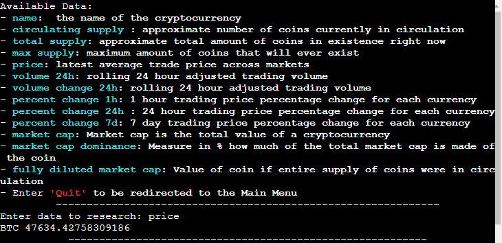

    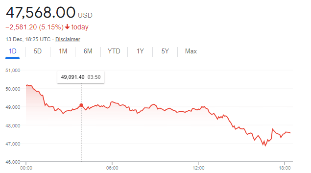

3. I want to be able to calculate the USD needed in order to purchase x amount of coins

    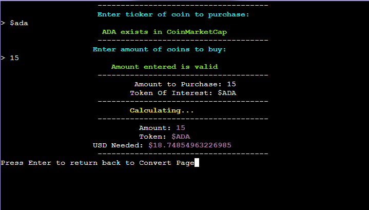

4. I want to be able to calculate the Amount I can purchase with x amount of USD

    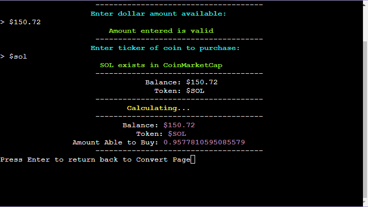

5. I want to be able to convert x amount of one coin into another coin

    

6. I want to see if there are new features added to the site 

    Any new features that have been added to the program will be visible in the Main Menu and will be added to the 'What is CoinFrog' section

---

# Bugs
* Not so much a bug but the [API](https://coinmarketcap.com/api/) I am using only allows 333 calls per day as I am using the free version. Each time the program is run 10 credits (calls) are used which means the program can be called 33 times a day before going over the limit. The limit is a soft limit meaning it does let you go over the 333 per day however after a certain amount of calls the API stop allowing calls meaning the program would not work if the limit is reached. 

* I have noticed that when the user selects option 1 form the main menu and the description of the program begins. Sometimes the program will freeze randomly and stop the text from outputting, the only way to get around this is to press the run button again in order to re-launch the program. I am unsure why this happens as it is not an error in the code but more of a problem with the mock terminal that it is being run on. 

## Reason for using noqa
On several lines of code in [setup.py](setup.py) and [coinmarketcap.py](coinmarketcap.py) I had use `# noqa` in order to remove the PEP8 errors where the lines were longer than 80 characters. I had to do this as the lines affected where often deeply nested and used f'strings. By trying to split the code across several lines it caused the actual formatting to break when being printed to the terminal, as a result I needed to apply `# noqa` on those lines in order for the code to execute correctly and to remove the error when validating the code through PEP8. I only used it when it was absolutely necessary and by instruction from my Mentor.  